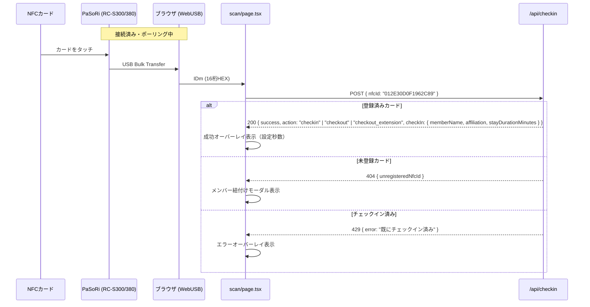
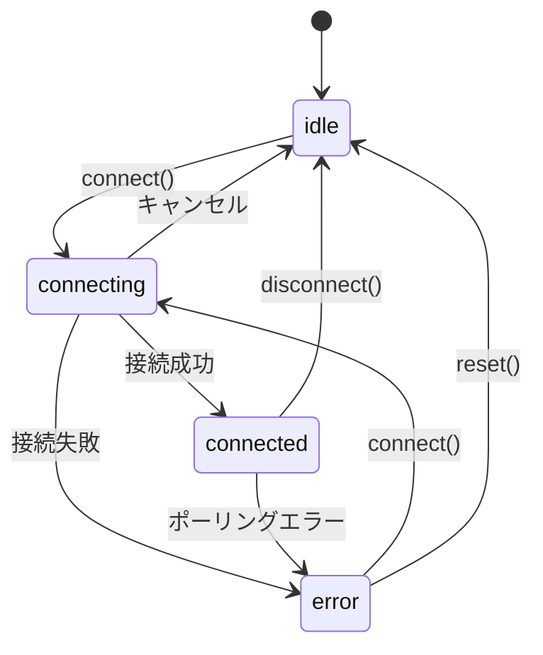

# NFCカードチェックイン 仕様書

## 1. 概要

本システムは、Sony PaSoRi（RC-S300 / RC-S380 系）を WebUSB 経由で制御し、FeliCa カード（交通系ICカード、学生証など）の IDm を読み取ってメンバーのチェックイン処理を行う機能です。

既存の QR コードチェックインと並行して動作し、同一の API・表示フローを共有します。

---

## 2. 対応デバイス

| モデル名 | Product ID | プロトコル |
|---|---|---|
| RC-S300/P (PaSoRi 4.0) | `0x0dc9` | CCID Escape (PC_to_RDR_Escape) |
| RC-S300/S | `0x0dc8` | CCID Escape |
| RC-S380/P | `0x06c3` | NFC Normal Frame |
| RC-S380/S | `0x06c1` | NFC Normal Frame |
| RC-S330 | `0x0bb7` | NFC Normal Frame |
| RC-S330 (旧) | `0x02e1` | NFC Normal Frame |

- **ベンダー ID**: `0x054c`（Sony Corporation）
- **インターフェース**: USB Vendor-Specific class (`0xFF`) を優先的に使用

---

## 3. データベーススキーマ

### `member_nfc_cards` テーブル

```sql
CREATE TABLE IF NOT EXISTS member_nfc_cards (
  id          INTEGER PRIMARY KEY AUTOINCREMENT,
  member_id   INTEGER NOT NULL,
  nfc_id      TEXT UNIQUE NOT NULL,         -- FeliCa IDm（16桁HEX文字列）
  card_name   TEXT NOT NULL,                -- カード名（例: "交通系ICカード"）
  created_at  DATETIME DEFAULT CURRENT_TIMESTAMP,
  FOREIGN KEY (member_id) REFERENCES members(id) ON DELETE CASCADE
);
```

- `nfc_id` は `UNIQUE` 制約により、1枚のカードが複数メンバーに紐付くことを防止。
- `member_id` の外部キー制約に `ON DELETE CASCADE` を設定し、メンバー削除時にカード情報も連動して削除。
- インデックス: `idx_nfc_card_nfc_id`（NFC ID 検索用）、`idx_nfc_card_member_id`（メンバー別取得用）

### リレーション

```
members (1) ←→ (N) member_nfc_cards
```

1人のメンバーは最大 **5枚** のNFCカードを登録可能。

---

## 4. NFC カード登録

### 4.1 登録ルート

NFCカードの登録は以下の2つのルートから行えます。

#### ルート A: 管理者がメンバー個別設定から追加

1. 管理者メンバー管理画面（`/admin/members`）でメンバーの編集を開く
2. 「NFCカード」セクションで「スキャン開始」ボタンを押す（スキャン中は「スキャナー解除」に変化）
3. カードをリーダーにタッチ → IDm を読み取り → 登録

#### ルート B: 未登録カードをタッチして登録

1. チェックインスキャン画面（`/scan`）で未登録のカードがタッチされる
2. API が `404` + `unregisteredNfcId` を返却
3. 「メンバー検索・紐付けモーダル」が表示される
4. 管理者がメンバーを検索・選択して紐付け → そのままチェックイン完了

#### ルート C: メンバー本人がマイページから追加

1. メンバー情報編集画面（`/member/edit`）の「NFCカード」セクション
2. 「スキャン開始」または手動入力で追加

### 4.2 バリデーション

| チェック項目 | 条件 | エラーメッセージ |
|---|---|---|
| 重複チェック | `nfc_id` が既に他メンバーに登録済み | 「このNFCカードは既に登録されています」 |
| 上限チェック | 1メンバーあたり5枚まで | 「NFCカードの登録数が上限に達しています」 |

---

## 5. チェックインフロー

### 5.1 全体フロー（NFC）



### 5.2 チェックイン・チェックアウト API

**エンドポイント**: `POST /api/checkin`

**リクエストボディ**:

```json
{
  "nfcId": "012E30D0F1962C89"
}
```

> QR コードチェックインの場合は `{ "qrCode": "..." }` を送信。両方を同時に送ることはない。

**レスポンス**:

| ステータス | ボディ | 説明 |
|---|---|---|
| `200` | `{ success: true, action: "checkin" \| "checkout" \| "checkout_extension", checkIn: { id, memberId, memberName, affiliation, email, stayDurationMinutes } }` | 処理成功（action に応じてチェックイン/チェックアウト/チェックアウト延長が決定） |
| `404` | `{ error: "未登録のNFCカードです", unregisteredNfcId: "..." }` | 未登録カード |
| `429` | `{ error: "このメンバーは既にチェックイン済みです。" }` | 再チェックイン制限内（前回のチェックインから一定時間未満でチェックインしようとした場合） |
| `400` | `{ error: "メンバーIDが読み取れませんでした" }` | パラメータ不足 |
| `500` | `{ error: "チェックイン処理中にエラーが発生しました" }` | サーバーエラー |

### 5.3 再入室・退室時間制限

- **再チェックイン制限** (`checkInIntervalMinutes`、デフォルト: 10分)
  - すでにチェックアウト（退室）済みの状態で、前回のチェックイン（入室）時刻からこの設定時間内の場合は、重複チェックインエラー (`429`) になります。
- **チェックアウト延長制限** (`checkOutIntervalMinutes`、デフォルト: 10分)
  - すでにチェックアウト済みの状態で再度スキャンした際、チェックアウト時刻からこの設定時間以内の場合は、新規のチェックインとはせず、前回の**チェックアウト時刻の更新（延長）**として処理します。
- いずれの設定値も管理者設定画面（`/admin/settings`）から変更可能です。

### 5.4 成功画面の表示

- 設定値: `successDisplaySeconds`（デフォルト: 10秒）
- 管理者設定画面（`/admin/settings`）から変更可能
- チェックイン成功時に全画面オーバーレイで登録者情報（名前・所属）を表示
- 設定秒数が経過すると自動的にフェードアウト
- QR コードチェックインと NFC チェックインで共通の表示ロジックを使用

---

## 6. WebUSB 通信仕様

### 6.1 フック: `useWebUSBFeliCa`

**ファイル**: `app/hooks/useWebUSBFeliCa.ts`

#### 公開インターフェース

```typescript
interface UseWebUSBFeliCaReturn {
  status: 'idle' | 'connecting' | 'connected' | 'reading' | 'success' | 'error';
  idm: string | null;
  errorMessage: string | null;
  isPolling: boolean;           // ポーリング中かどうか
  connect: () => Promise<boolean>;
  readIdm: () => Promise<string | null>;
  disconnect: () => Promise<void>;
  reset: () => void;
}
```

#### ステータス遷移



> **設計上の重要ポイント**: `readIdm()` 呼び出し中も `status` は `'connected'` を維持する。ポーリング状態は `isPolling` フラグで外部に公開する。これにより React の `useEffect` 依存配列で `nfcStatus` を監視しているコンポーネントが、ポーリング中に不要なクリーンアップ→再起動を行わない。

#### 自動接続

- **初回マウント時**: `navigator.usb.getDevices()` でペアリング済みの PaSoRi を自動探索し、見つかれば即座に接続（ダイアログなし）
- **USB 接続イベント**: PaSoRi が物理的に接続された場合、`connect` イベントで自動接続を試みる
- **USB 切断イベント**: PaSoRi が物理的に切断された場合、`disconnect` イベントで状態をリセット

### 6.2 FeliCa Polling プロトコル

#### RC-S300 系

CCID Escape コマンド（`0x6B`）を使用し、10バイトヘッダでラップして Bulk Transfer を行う。

```
1. endtransparent  → 0xFF 0x50 0x00 0x00 0x02 0x82 0x00 0x00
2. starttransparent → 0xFF 0x50 0x00 0x00 0x02 0x81 0x00 0x00
3. RF off           → 0xFF 0x50 0x00 0x00 0x02 0x83 0x00 0x00
4. RF on            → 0xFF 0x50 0x00 0x00 0x02 0x84 0x00 0x00
5. SwitchProtocolTypeF → 0xFF 0x50 0x00 0x02 0x04 0x8F 0x02 0x03 0x00 0x00
6. FeliCa Polling (System Code FF FF)
```

IDm はレスポンスの **offset 26〜33**（8バイト）から取得。

#### RC-S380 系

NFC Normal Frame を使用し、ACK/レスポンスの2段階受信を行う。

```
1. SetCommandType
2. SwitchRF × 2
3. InSetRF
4. InSetProtocol × 2
5. InCommRF (FeliCa Polling)
```

IDm はレスポンスの **offset 17〜24**（8バイト）から取得。

### 6.3 IDm フォーマット

- 8バイトのバイナリ値
- 16桁の大文字HEX文字列として保存（例: `012E30D0F1962C89`）
- すべてゼロの場合は「カードなし」として扱い `null` を返却

---

## 7. NFC 読み取りループ（スキャン画面）

**ファイル**: `app/scan/page.tsx`

### 7.1 ループ制御

```
nfcStatus === 'connected' 時に起動
  → nfcLoopActiveRef (useRef) で制御
  → readNfcIdm() を繰り返し呼び出し
  → IDm が返されたら handleCheckIn(undefined, idm) を呼ぶ
  → nfcStatus が 'connected' から離れたら cleanup で停止
```

#### 重要な設計判断

| 課題 | 解決策 |
|---|---|
| `readIdm` 内で `setStatus('reading')` すると `useEffect` が cleanup を発火 | `readIdm` は `status` を変更せず `isPolling` フラグで通知 |
| `useEffect` の deps に state 値を入れるとループが停止 | deps は `[nfcStatus]` のみ。モーダル等は `useRef` で追跡 |
| ループの二重起動 | `nfcLoopActiveRef` で排他制御 |
| エラー後の自動復帰 | `readIdm` がエラー時に `disconnect()` を呼ばず ctx を維持 |

### 7.2 連続読み取り防止

- 同一の IDm が `successDisplaySeconds` 秒以内に再度読み取られた場合はスキップ
- `processingRef.current === true` の間（チェックイン処理中）は新たな読み取りを行わない

---

## 8. NFC カード管理 API

### 8.1 管理者用

| メソッド | エンドポイント | 説明 |
|---|---|---|
| `GET` | `/api/admin/members/[id]/nfc-cards` | メンバーのNFCカード一覧取得 |
| `POST` | `/api/admin/members/[id]/nfc-cards` | NFCカード追加 |
| `DELETE` | `/api/admin/members/[id]/nfc-cards` | NFCカード削除 |

### 8.2 メンバー用（マイページ）

| メソッド | エンドポイント | 説明 |
|---|---|---|
| `GET` | `/api/member/nfc-cards` | 自分のNFCカード一覧取得 |
| `POST` | `/api/member/nfc-cards` | NFCカード追加（上限5枚） |
| `DELETE` | `/api/member/nfc-cards/[cardId]` | NFCカード削除 |
| `PATCH` | `/api/member/nfc-cards/[cardId]` | カード名変更 |

---

## 9. トラブルシューティング

| 症状 | 原因 | 対処 |
|---|---|---|
| 「接続エラー: Unable to claim interface」 | macOS の `pcscd` がデバイスを占有 | `sudo killall pcscd` を実行 |
| 「PaSoRi が接続されていません」 | USB ケーブルの接触不良 / デバイス未認識 | ケーブル差し直し、ブラウザ再起動 |
| ペアリングダイアログが毎回出る | ブラウザのペアリング許可がリセットされた | 一度ダイアログで許可すれば次回以降は自動接続 |
| カードをかざしても反応なし | ポーリングエラーで ctx が失われた | 「カードリーダーを接続」ボタン（または「スキャン開始」）で再接続 |
| チェックイン成功だが表示されない | オーバーレイが transform 親内にある | オーバーレイは transform 外に配置すること |

---

## 10. 関連ファイル一覧

| ファイル | 役割 |
|---|---|
| `app/hooks/useWebUSBFeliCa.ts` | WebUSB FeliCa フック（PaSoRi 接続・ポーリング） |
| `app/scan/page.tsx` | チェックインスキャン画面（NFC読み取りループ） |
| `app/admin/members/page.tsx` | 管理者メンバー管理（NFCカード登録・削除） |
| `app/member/edit/page.tsx` | メンバー情報編集（NFCカード管理） |
| `app/api/checkin/route.ts` | チェックイン API |
| `app/api/admin/members/[id]/nfc-cards/route.ts` | 管理者用NFCカード API |
| `app/api/member/nfc-cards/route.ts` | メンバー用NFCカード API |
| `lib/database.ts` | データベース操作（`member_nfc_cards` テーブル） |
| `lib/settings.ts` | サイト設定（`successDisplaySeconds` 等） |
